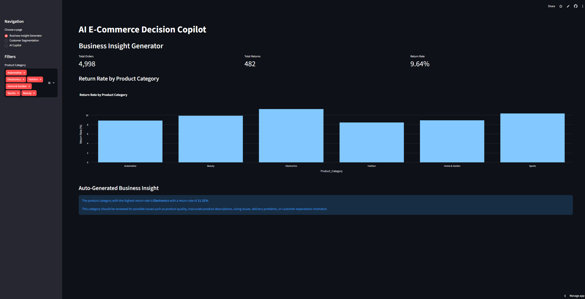
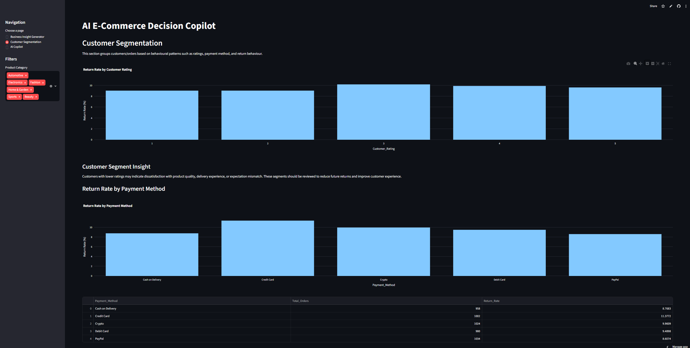
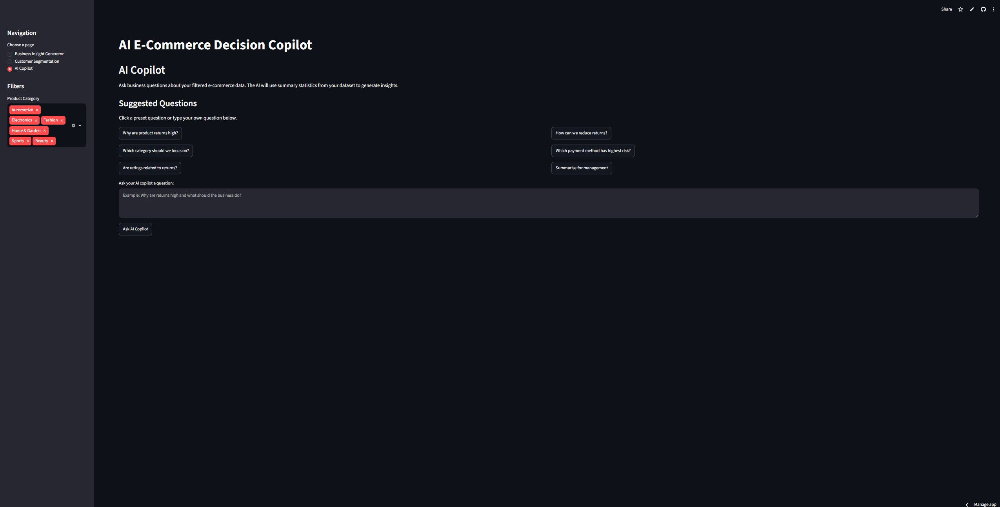
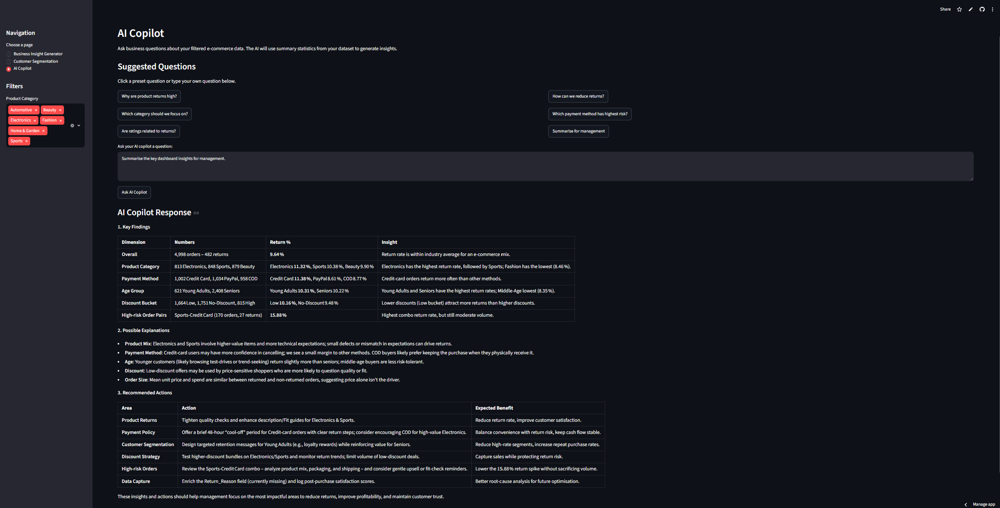

# AI-Powered E-Commerce Decision Copilot

An AI-powered Streamlit dashboard for analysing e-commerce return behaviour, customer segments, product categories, payment methods, and business recommendations.

This project combines interactive data visualisation with an AI copilot powered by OpenRouter, allowing users to ask natural-language business questions and receive data-driven insights based on the filtered dataset.

## Live Demo

[View the deployed Streamlit app](https://ecompilot.streamlit.app/)

## Project Overview

Product returns are an important business problem in e-commerce because they can affect revenue, customer satisfaction, logistics cost, and inventory planning.

This project helps users explore return behaviour by analysing patterns across product categories, customer ratings, payment methods, age groups, discounts, order quantity, and total spend. The AI copilot summarises the filtered data and generates business-friendly explanations and recommendations.

## Features

* Interactive business dashboard with key return KPIs
* Product category return-rate analysis
* Customer segmentation by rating and payment method
* Sidebar filters for dynamic analysis
* AI copilot powered by OpenRouter API
* Natural-language question answering for business insights
* Dataset summary generation from filtered data instead of sending the full raw dataset
* Business recommendations based on return-risk patterns

## Tech Stack

* Python
* Streamlit
* Pandas
* Plotly
* OpenRouter API
* OpenAI Python SDK
* python-dotenv

## How the AI Copilot Works

The app reads a cleaned e-commerce CSV file and applies the user's selected filters. It then generates a compact summary of the filtered dataset, including return rates, order counts, customer rating patterns, payment method patterns, discount groups, and other key metrics.

This summary is sent to the AI copilot through the OpenRouter API. The AI then provides clear business insights and practical recommendations based only on the provided data context.

## Example Questions for the AI Copilot

Users can ask questions such as:

* Which product category has the highest return risk?
* Are customer ratings related to return behaviour?
* Do discounts appear to affect product returns?
* Which payment method has the highest return rate?
* Are returned orders different from non-returned orders in terms of price, quantity, or total spend?
* What are the key insights for management?
* What actions can the business take to reduce returns?

## Key Business Value

This project demonstrates how AI can support business decision-making by turning dashboard metrics into natural-language insights. Instead of manually interpreting charts, users can ask the AI copilot direct questions and receive structured explanations with recommended actions.

## Future Improvements

* Add a return-risk prediction model
* Add RFM customer segmentation
* Add downloadable PDF or CSV reports
* Add monthly trend analysis
* Add more advanced customer behaviour analysis
* Improve AI response formatting with charts and summaries

## Screenshots

### Business Insight Generator

### Customer Segmentation

### AI Copilot

### AI Copilot Response

